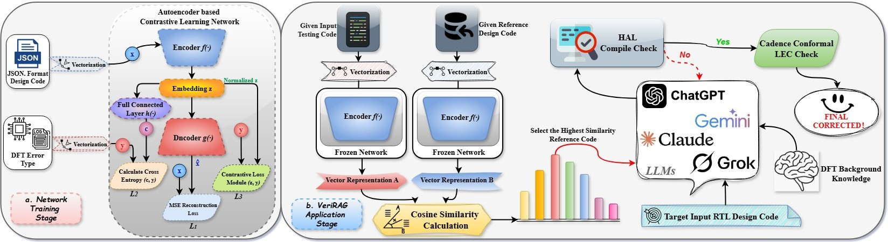

# VeriRAG: Retrieval-Augmented Generation for Automated RTL Testability Repair

[](LICENSE)

---

## Overview

**VeriRAG** is the first open-source Retrieval-Augmented Generation (RAG) framework for Design-for-Testability (DFT) repair in RTL (Verilog) designs using Large Language Models (LLMs). This repository enables fully automated DFT error correction and benchmarking for both researchers and industry practitioners in EDA, LLM, and hardware verification.

Our release includes:

- **Dataset (VeriDFT)**: A thoroughly curated, cleaned, and labeled collection of synthesizable Verilog files with DFT errors and their validated corrections.
- **Experimental Results**: Comprehensive benchmarking results of VeriRAG and three ablation baselines, tested on five cutting-edge LLMs.
- **Code**: Scripts for VeriRAG related, autoencoder network training, the iterative repair pipeline, all ablation study pipelines, and prompt engineering files.

---

## Repository Structure

```text
├── Dataset/
│   ├── part1/ ... part9/        # 8,000+ cleaned, compilable Verilog files (from 108,971 raw files, partitioned due to folder limits)
│   ├── JSON_Format              # JSON format corresponding to 437 Verilog codes
│   └── VeriDFT/
│       ├── All_Answer_Code/         # Gold-standard DFT-corrected reference Verilog files
│       ├── All_Source_Code/         # Raw Verilog files containing DFT errors
│       ├── Use_for_Reference/       # Parts used for reference in network training and VeriRAG framework
│       ├── Use_for_Testing/         # Part of the network training and testing in the VeriRAG framework
│       └── Use_for_training/        # Network training and the part used for training in the VeriRAG framework
│
├── Experimental Results/
│   ├── VeriRAG/                 # Full test logs and results for VeriRAG
│   ├── ZeroShot/                # Baseline results (no external context)
│   ├── NoRAG/                   # Ablation: No retrieval-based guidance
│   └── RandomRAG/               # Ablation: Random reference retrieval
│   # All results are reported for GPT-o1, GPT-4o, Grok-3, Claude-3.7-Sonnet, and Gemini-2.5-Pro
│
├── VeriRAG/
│   ├── Autoencoder_training_network/        # Unified script for network training
│   ├── No_RAG_pipline/                      # Script to automate No RAG ablation studies in an iterative-repair framework
│   ├── Random_RAG_pipline/                  # Script to automate Random RAG ablation studies in an iterative-repair framework
│   ├── VeriRAG_Revision_Pipline/            # Script to automate VeriRAG ablation studies in an iterative-repair framework
│   ├── Zero_Shot_pipline/                   # Script to automate Zero Shot ablation studies in an iterative-repair framework
│   ├── prompts/                             # All prompts used for LLM interaction
│
├── LICENSE                      # Apache 2.0 License
└── README.md                    # This file
```
---

## Getting Started

### Requirements

- Python 3.8+
- [scikit-learn](https://scikit-learn.org/) (TF-IDF vectorization, clustering)
- [PyTorch](https://pytorch.org/) (autoencoder model training and inference)
- [Yosys](https://yosyshq.net/yosys/) (open-source RTL synthesis, for Verilog-to-JSON conversion)
- [Cadence Xcelium](https://www.cadence.com/) and [Cadence Conformal LEC](https://www.cadence.com/) (for DFT validation and logic equivalence check; **proprietary, license required**)
- API access to LLM providers (e.g., OpenAI GPT, Gemini, Claude, Grok, etc.)

---

### How to Use

#### 1. Explore and Prepare the Dataset

- `Dataset/part1` ... `part9`: Contains 8,000+ rigorously cleaned and synthesizable Verilog files. These are partitioned due to OS folder size limits.
- `Dataset/VeriDFT/`: Curated for DFT research, includes:
  - **437 Verilog files**, each exhibiting a single canonical DFT error (ACNCPI, CLKNPI, CDFDAT, or FFCKNP), with error type and location annotated.
  - **All_Answer_Code/**: Gold-standard, manually corrected, DFT-compliant Verilog designs (paired with the test/reference set).
  - **All_Source_Code/**: Raw, error-containing Verilog files.
  - **Use_for_Reference/**: 35 reference designs (with paired answers) used for retrieval during repair and benchmarking.
  - **Use_for_Testing/**: 317 test designs used for performance evaluation.
  - **Use_for_training/**: 85 designs for training the similarity autoencoder.
  - **JSON_Format/**: Yosys-generated structural JSON for all 437 codes, used as the input feature for autoencoder-based retrieval and similarity analysis.

> **Tip:** All reference, test, and training sets are strictly partitioned to avoid data leakage in retrieval or evaluation.

#### 2. Generate Structural JSONs (If Extending or Customizing)

- Use [Yosys](https://yosyshq.net/yosys/) to convert Verilog to netlist-level JSON format:
  - Example command:  
    ```bash
    yosys -p "read_verilog your_file.v; write_json your_file.json"
    ```
  - All JSONs for the main VeriDFT set are pre-generated in `Dataset/VeriDFT/JSON_Format/`.

#### 3. Train the Autoencoder for RTL Similarity

- The autoencoder pipeline is in `VeriRAG/Autoencoder_training_network/`.
- **Training Data:** Use JSONs and DFT error labels in `Use_for_training/` (see script comments for detailed instructions).
- **Feature Extraction:** Scripts will automatically apply TF-IDF vectorization to flattened JSON (512-dim features).
- **Model:** Multi-task autoencoder jointly optimizes reconstruction, DFT error classification, and supervised contrastive learning loss.
- **Output:** Encoder weights for retrieval, cluster assignments, and similarity metrics.

#### 4. Run Similarity-Based Retrieval and LLM Repair

- **All automated pipelines are in `VeriRAG/` subfolders**:
  - `VeriRAG_Revision_Pipline/`: Main VeriRAG pipeline (autoencoder-based retrieval + iterative LLM repair).
  - `No_RAG_pipline/`, `Random_RAG_pipline/`, `Zero_Shot_pipline/`: Baselines for ablation studies.
- **Typical Workflow:**
  1. For each test file, retrieve the most similar reference code (and its gold answer) via the frozen autoencoder.
  2. Compose the LLM prompt with the target code, background, error type definitions, and retrieved reference/answer.
  3. The LLM generates a candidate repair. Run Xcelium for compilation and DFT check.
  4. If DFT errors remain or compilation fails, provide feedback to the LLM and iterate (max 5 rounds by default).
  5. Upon successful DFT pass, run Conformal LEC to ensure logic equivalence.
  6. Log results, including error correction and equivalence metrics.

> **Prompts and task configuration templates are all in `VeriRAG/prompts/` and are easily extensible.**

#### 5. Benchmarking and Result Analysis

- All benchmarking results (raw logs, error types, correction rates, logic equivalence rates) are in `Experimental Results/`:
  - `VeriRAG/`: Main pipeline results.
  - `ZeroShot/`, `NoRAG/`, `RandomRAG/`: Ablation results.
  - Results are reported for GPT-o1, GPT-4o, Grok-3, Claude-3.7-Sonnet, and Gemini-2.5-Pro.
- Use provided summary scripts or parse logs for custom analysis.

---

### Reproducing Our Results

All results in our paper can be **directly reproduced** with this repository:

- Follow instructions in each subfolder’s README or script header.
- **Ensure you have valid licenses** for Cadence Xcelium and Conformal LEC for full DFT and logic equivalence checking. Open-source alternatives may suffice for partial verification, but will not replicate published metrics.
- For LLM inference, obtain API keys as needed and set environment variables accordingly.

---

## Citation

If you use this dataset, code, or experimental results in your work, **please cite** the following:

```bibtex
@misc{qi2025veriragretrievalaugmentedframeworkautomated,
      title={VeriRAG: A Retrieval-Augmented Framework for Automated RTL Testability Repair}, 
      author={Haomin Qi and Yuyang Du and Lihao Zhang and Soung Chang Liew and Kexin Chen and Yining Du},
      year={2025},
      eprint={2507.15664},
      archivePrefix={arXiv},
      primaryClass={cs.AR},
      url={https://arxiv.org/abs/2507.15664}, 
}
```
